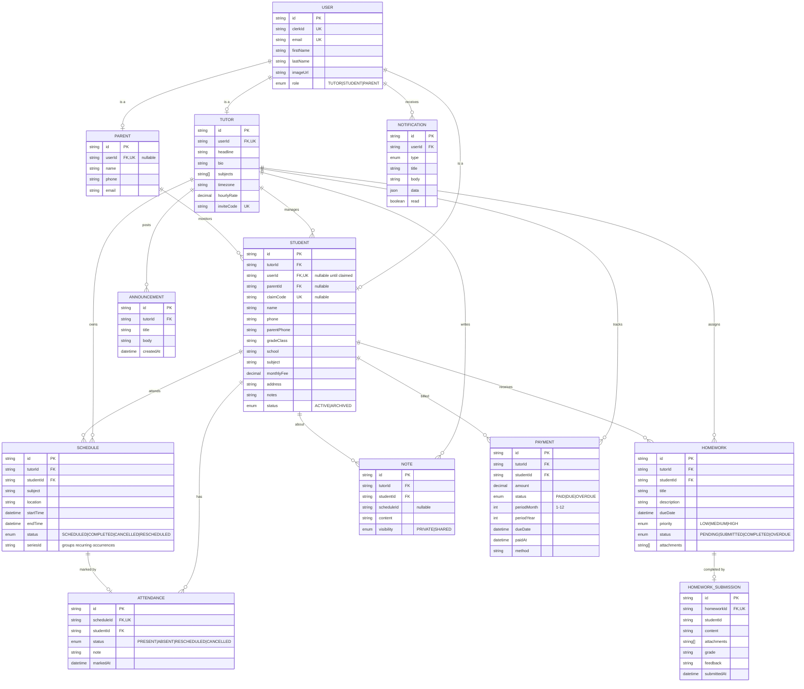

# Entity-Relationship Diagram

The canonical source of truth is [`prisma/schema.prisma`](../prisma/schema.prisma).
This diagram renders on GitHub (Mermaid) and mirrors that schema.

## Key relationships & constraints

- **`User` is the identity root** (mirrors a Clerk user). A user is _at most one_
  of Tutor / Student / Parent via optional 1:1 relations.
- **`Student.userId` is nullable** — a tutor can add a student before that
  student ever signs up. The student later "claims" the profile with a
  `claimCode`, which links their `userId`.
- **`Tutor.inviteCode`** lets students self-join a tutor during onboarding.
- **`Schedule` is one concrete session.** Recurring classes are expanded into
  many `Schedule` rows sharing a `seriesId` (so "delete series" is possible).
- **`Attendance` is 1:1 with `Schedule`** (`scheduleId` is unique).
- **`Payment` is unique per `(studentId, periodYear, periodMonth)`** — one
  invoice per student per month; "generate invoices" is therefore idempotent.
- **Cascade deletes**: deleting a Tutor or Student cascades to their dependent
  rows (schedules, attendance, homework, notes, payments). Deleting a `User`
  sets dependent `userId`s to null where the profile should survive.
